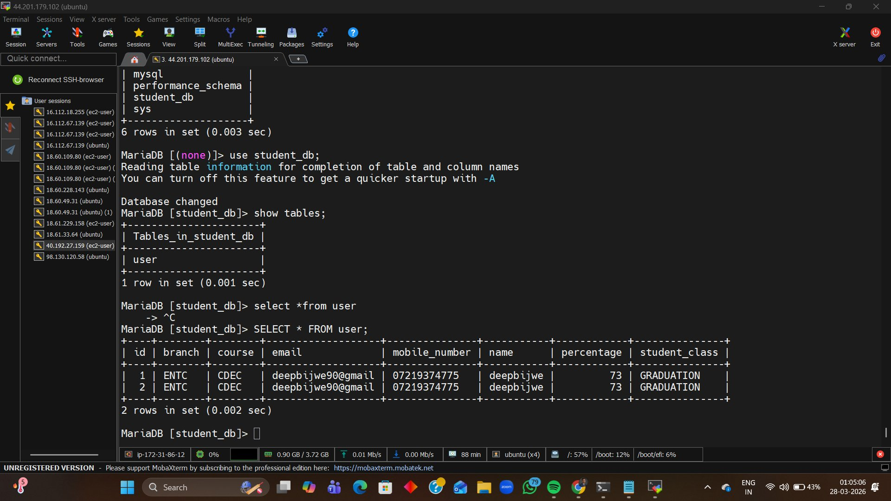
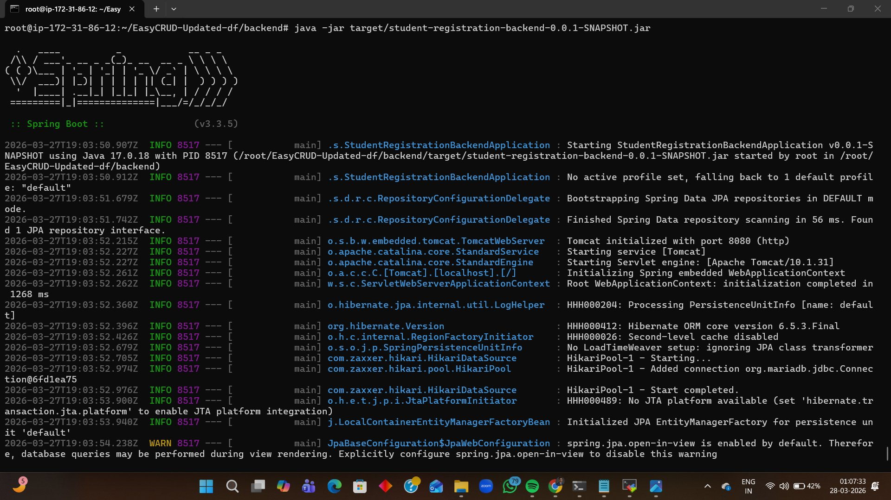
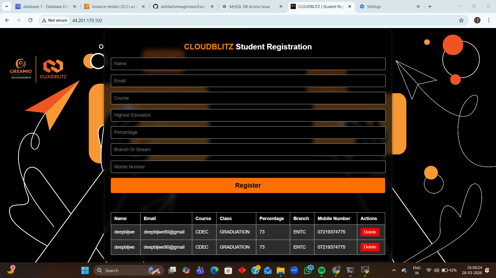

# 🚀 3-Tier Web Application Deployment on AWS EC2

> **Project:** CLOUDBLITZ Student Registration App  
> **Stack:** HTML/JS Frontend · Spring Boot Backend · MariaDB Database  
> **Cloud:** AWS EC2 (Ubuntu 22.04)  
> **Author:** Deep Bijwe | [deepbijwe.in](https://deepbijwe.in) | [GitHub](https://github.com/deepbijwe)

---

## 📐 Architecture Overview

```
┌─────────────────────────────────────────────┐
│              AWS EC2 (Ubuntu)               │
│                                             │
│  ┌─────────────────────────────────────┐    │
│  │  Tier 1 — Presentation Layer        │    │
│  │  HTML / CSS / JS  ·  Port 80        │    │
│  └────────────────┬────────────────────┘    │
│                   │ HTTP                    │
│  ┌────────────────▼────────────────────┐    │
│  │  Tier 2 — Application Layer         │    │
│  │  Spring Boot 3.3.5 · Java 17        │    │
│  │  Embedded Tomcat  ·  Port 8080      │    │
│  └────────────────┬────────────────────┘    │
│                   │ JDBC / JPA              │
│  ┌────────────────▼────────────────────┐    │
│  │  Tier 3 — Data Layer                │    │
│  │  MariaDB · student_db · Port 3306   │    │
│  └─────────────────────────────────────┘    │
└─────────────────────────────────────────────┘
```

---

## 📋 Prerequisites

| Tool | Version |
|------|---------|
| AWS EC2 | Ubuntu 22.04 LTS |
| Java | OpenJDK 17 |
| Maven | 3.x |
| MariaDB | Latest |
| Nginx | Latest |
| Git | Latest |

---

## 🛠️ Step-by-Step Deployment Guide

---

### Step 1 — Launch AWS EC2 Instance

1. Go to **AWS Console → EC2 → Launch Instance**
2. Select **Ubuntu 22.04 LTS**, instance type `t2.micro`
3. Configure **Security Group** inbound rules:

| Port | Protocol | Purpose |
|------|----------|---------|
| 22 | TCP | SSH Access |
| 80 | TCP | HTTP (Frontend) |
| 8080 | TCP | Spring Boot Backend |
| 3306 | TCP | MariaDB (VPC only) |

4. Create/attach a Key Pair and launch

---

### Step 2 — Connect & Update Server

```bash
ssh -i your-key.pem ubuntu@<EC2-PUBLIC-IP>
sudo apt update && sudo apt upgrade -y
```

---

### Step 3 — Install Java 17

```bash
sudo apt install openjdk-17-jdk -y
java -version
```

Expected output:
```
openjdk version "17.x.x"
```

---

### Step 4 — Install & Configure MariaDB (Tier 3 — Data Layer)

```bash
sudo apt install mariadb-server -y
sudo systemctl start mariadb
sudo systemctl enable mariadb
sudo mysql_secure_installation
```

Create the database and user:

```sql
sudo mysql -u root -p

CREATE DATABASE student_db;
CREATE USER 'appuser'@'localhost' IDENTIFIED BY 'yourpassword';
GRANT ALL PRIVILEGES ON student_db.* TO 'appuser'@'localhost';
FLUSH PRIVILEGES;
EXIT;
```

#### ✅ Database Verified — MariaDB `student_db` with `user` table



> Screenshot shows `student_db` database running with the `user` table containing registered student records queried via MariaDB CLI.

---

### Step 5 — Clone & Configure Spring Boot App (Tier 2 — Application Layer)

```bash
sudo apt install git maven -y
git clone https://github.com/abhilashmwaghmare/EasyCRUD-Updated-df.git
cd EasyCRUD-Updated-df/backend
```

Edit `src/main/resources/application.properties`:

```properties
spring.datasource.url=jdbc:mariadb://localhost:3306/student_db
spring.datasource.username=appuser
spring.datasource.password=yourpassword
spring.datasource.driver-class-name=org.mariadb.jdbc.Driver
spring.jpa.hibernate.ddl-auto=update
server.port=8080
```

---

### Step 6 — Build & Run the Backend

```bash
mvn clean package -DskipTests
java -jar target/student-registration-backend-0.0.1-SNAPSHOT.jar
```

Run in background (persistent after SSH disconnect):

```bash
nohup java -jar target/student-registration-backend-0.0.1-SNAPSHOT.jar \
  > /var/log/app.log 2>&1 &
```

#### ✅ Spring Boot Started Successfully



> Screenshot shows Spring Boot 3.3.5 starting with Java 17, Tomcat initializing on port 8080, HikariCP connection pool connecting to MariaDB, and Hibernate JPA bootstrapping successfully.

**Key log entries confirming success:**
- `Tomcat initialized with port 8080 (http)` ✅
- `HikariPool-1 - Start completed` ✅
- `Initialized JPA EntityManagerFactory` ✅

---

### Step 7 — Install & Configure Nginx (Tier 1 — Presentation Layer)

```bash
sudo apt install nginx -y
sudo systemctl start nginx
sudo systemctl enable nginx
```

Configure reverse proxy at `/etc/nginx/sites-available/default`:

```nginx
server {
    listen 80;
    server_name <EC2-PUBLIC-IP>;

    location / {
        proxy_pass http://localhost:8080;
        proxy_set_header Host $host;
        proxy_set_header X-Real-IP $remote_addr;
        proxy_set_header X-Forwarded-For $proxy_add_x_forwarded_for;
    }
}
```

Apply and reload:

```bash
sudo nginx -t
sudo systemctl reload nginx
```

---

### Step 8 — Access the Live Application

Open browser and navigate to:

```
http://<EC2-PUBLIC-IP>
```

#### ✅ Application Live — Student Registration Form



> Screenshot shows the CLOUDBLITZ Student Registration app running live on AWS EC2 public IP `44.201.179.102`. The form accepts Name, Email, Course, Highest Education, Percentage, Branch, and Mobile Number fields, with registered data displayed in the table below.

---

## ✅ Verification Checklist

```bash
# MariaDB running
sudo systemctl status mariadb

# Spring Boot running
curl http://localhost:8080

# Check registered data in DB
mysql -u appuser -p student_db -e "SELECT * FROM user;"

# Nginx proxying correctly
curl http://<EC2-PUBLIC-IP>
```

---

## 🧠 Key Learnings

- ✅ Provisioned and configured a **Linux server on AWS EC2** from scratch
- ✅ Set up **MariaDB** and connected it via **Spring Data JPA / Hibernate**
- ✅ Built and deployed a **Spring Boot JAR** in production using `nohup`
- ✅ Configured **Nginx as a reverse proxy** to route port 80 → 8080
- ✅ Understood **3-Tier Architecture** separation of concerns in a real deployment

---

## 🔗 Resources

- [Spring Boot Docs](https://spring.io/projects/spring-boot)
- [AWS EC2 User Guide](https://docs.aws.amazon.com/ec2/)
- [MariaDB Documentation](https://mariadb.org/documentation/)
- [Nginx Reverse Proxy Guide](https://nginx.org/en/docs/)

---

> 💡 **Built as part of hands-on cloud training at CLOUDBLITZ x GREAMIO Technologies**  
> 👤 **Deep Bijwe** | B.E. Electronics & Telecom | AWS Certified Cloud Practitioner (CLF-C02)  
> 🌐 [deepbijwe.in](https://deepbijwe.in) · [GitHub](https://github.com/deepbijwe) · [LinkedIn](https://linkedin.com/in/deep-bijwe)