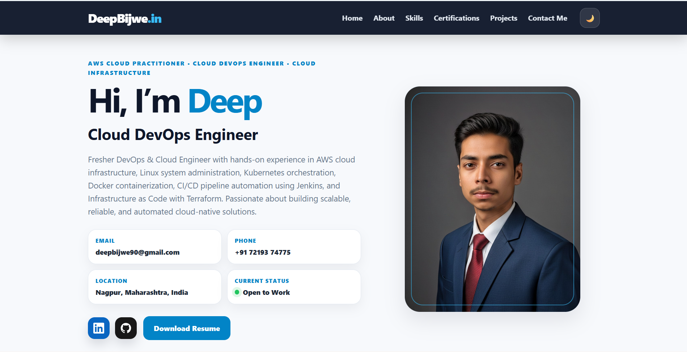
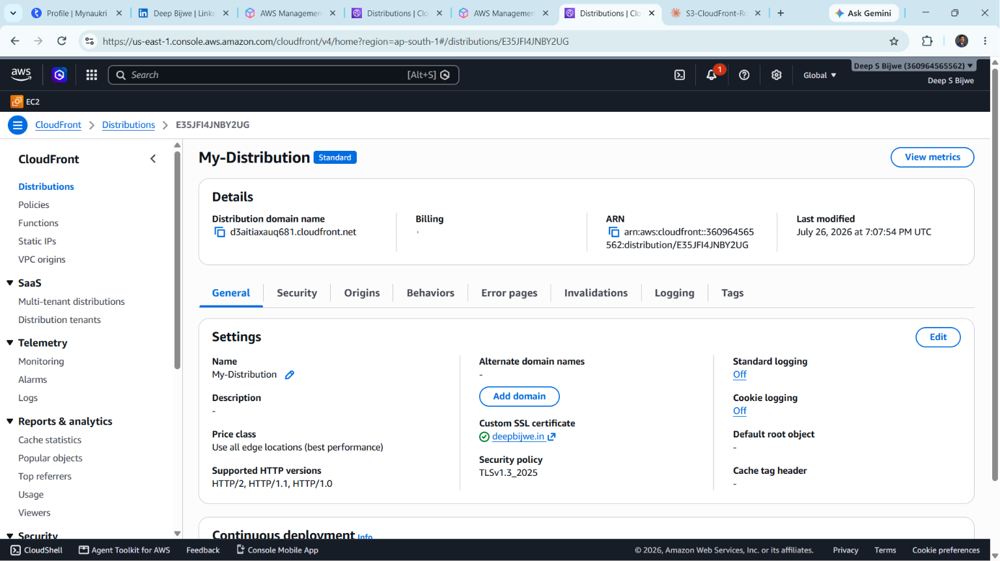
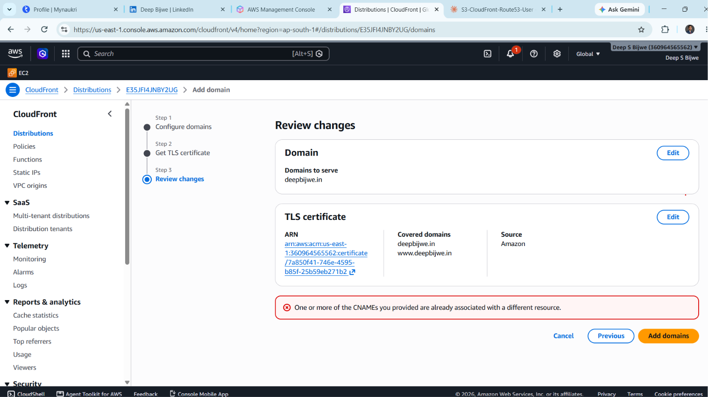
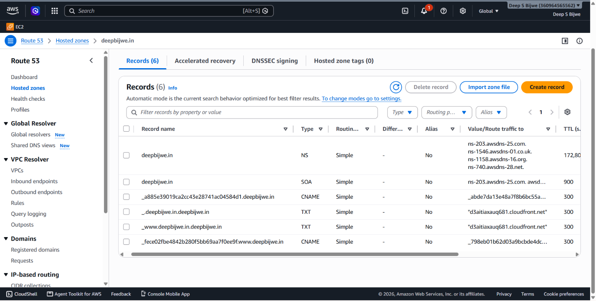
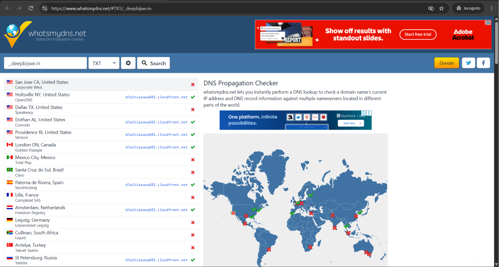
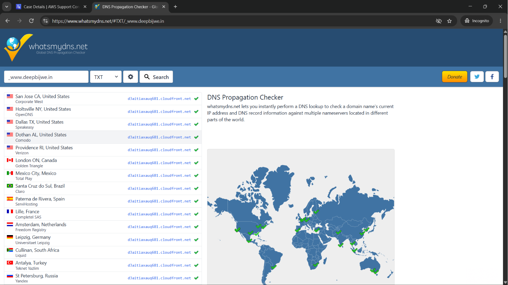

# 🌐 Static Portfolio Website — AWS S3 + CloudFront + Route 53

> Hosted my personal Cloud DevOps portfolio at **[deepbijwe.in](https://deepbijwe.in)** using AWS S3 for storage, CloudFront as a global CDN, ACM for SSL/TLS, and Route 53 for DNS management — including a real-world AWS account migration and AWS Support-assisted CNAME domain transfer.

---

## 🌐 Live Site


*Portfolio live at [https://deepbijwe.in](https://deepbijwe.in)*

---

## 🏗️ Architecture

```
User Request
     │
     ▼
Route 53 (DNS)
deepbijwe.in / www.deepbijwe.in
     │
     ▼
CloudFront Distribution (Global CDN)
• HTTPS enforced (HTTP → HTTPS redirect)
• OAC — private S3 access only
• Custom 404/403 error pages
• All edge locations (best performance)
• TLSv1.3_2025 security policy
     │
     ▼
S3 Bucket — deepbijwe-prortfolio (ap-south-1)
• index.html  (33.4 KB)
• error.html  (10.2 KB)
• Block all public access ON
• OAC bucket policy — CloudFront only
```

---

## ☁️ AWS Services Used

| Service | Purpose |
|---|---|
| **Amazon S3** | Private static file storage (origin) |
| **Amazon CloudFront** | Global CDN, HTTPS termination, caching |
| **AWS Certificate Manager (ACM)** | Free SSL/TLS certificate (us-east-1) |
| **Amazon Route 53** | DNS hosted zone, A/AAAA alias records |
| **AWS WAF** | Web Application Firewall (DDoS protection) |
| **AWS Support** | CNAME domain transfer across AWS accounts |

---

## 📁 Project Files

```
portfolio-website/
├── index.html           # Portfolio homepage (33.4 KB)
├── error.html           # Custom 404 error page (10.2 KB)
├── README.md
└── screenshots/
    ├── 01-cname-error.png
    ├── 02-cloudfront-distribution.png
    ├── 03-route53-wrong-txt-records.png
    ├── 04-dns-propagation-partial.png
    ├── 05-dns-propagation-full.png
    └── 06-portfolio-live.png
```

---

## 🪜 Step-by-Step Implementation

### Step 1 — Route 53: Create Hosted Zone

- Navigated to **Route 53 → Hosted zones → Create hosted zone**
- Domain name: `deepbijwe.in` — Type: Public hosted zone
- AWS auto-generated 4 NS records + 1 SOA record

```
NS Records:
  ns-1546.awsdns-01.co.uk
  ns-1158.awsdns-16.org
  ns-740.awsdns-28.net
  ns-203.awsdns-25.com
```

---

### Step 2 — GoDaddy: Update Nameservers to AWS

- GoDaddy → Domain → Nameservers → **"I'll use my own nameservers"**
- Replaced GoDaddy default NS with the 4 Route 53 NS values above
- DNS delegation now fully controlled by AWS Route 53

---

### Step 3 — S3: Create Bucket & Upload Files

**Bucket configuration:**
- Region: `ap-south-1` (Asia Pacific — Mumbai)
- Bucket name: `deepbijwe-prortfolio`
- Block all public access: ✅ ON
- Versioning: Disabled — Encryption: SSE-S3
- Static website hosting: Enabled
  - Index document: `index.html`
  - Error document: `error.html`

| File | Size |
|---|---|
| `index.html` | 33.4 KB |
| `error.html` | 10.2 KB |

---

### Step 4 — ACM: Request SSL Certificate (us-east-1)

> ⚠️ CloudFront requires SSL certificates in **us-east-1 (N. Virginia)** only.

- Switched region to **US East (N. Virginia)**
- Requested certificate covering `deepbijwe.in` + `www.deepbijwe.in`
- Validation: DNS validation → CNAME auto-created in Route 53
- Status: **Issued** ✅

```
Certificate ARN:
arn:aws:acm:us-east-1:360964565562:certificate/7a850f41-746e-4595-b85f-25b59eb271b2
Covered: deepbijwe.in, www.deepbijwe.in
```

---

### Step 5 — CloudFront: Create Distribution


*CloudFront distribution `E35JFI4JNBY2UG` with SSL cert attached and domain configured*

| Setting | Value |
|---|---|
| Origin domain | `deepbijwe-prortfolio.s3.ap-south-1.amazonaws.com` |
| Origin path | *(blank)* |
| Origin access | OAC — Allow private S3 bucket access ✅ |
| Viewer protocol | Redirect HTTP to HTTPS |
| Alternate domain names | `deepbijwe.in`, `www.deepbijwe.in` |
| Custom SSL certificate | `deepbijwe.in` (ACM — us-east-1) |
| Security policy | TLSv1.3_2025 |
| Default root object | `index.html` |
| Price class | All edge locations |

```
Distribution ID:  E35JFI4JNBY2UG
Domain:           d3aitiaxauq681.cloudfront.net
Account:          360964565562
```

---

### Step 6 — S3 Bucket Policy: Allow CloudFront OAC

```json
{
  "Version": "2008-10-17",
  "Id": "PolicyForCloudFrontPrivateContent",
  "Statement": [
    {
      "Sid": "AllowCloudFrontServicePrincipal",
      "Effect": "Allow",
      "Principal": {
        "Service": "cloudfront.amazonaws.com"
      },
      "Action": "s3:GetObject",
      "Resource": "arn:aws:s3:::deepbijwe-prortfolio/*",
      "Condition": {
        "ArnLike": {
          "AWS:SourceArn": "arn:aws:cloudfront::360964565562:distribution/E35JFI4JNBY2UG"
        }
      }
    }
  ]
}
```

---

### Step 7 — CloudFront: Custom Error Pages

| HTTP Error Code | Response Page | Response Code |
|---|---|---|
| 403 | `/error.html` | 404 |
| 404 | `/error.html` | 404 |

---

### Step 8 — Route 53: Final DNS Records

| Record | Type | Alias | Routes To |
|---|---|---|---|
| `deepbijwe.in` | A | Yes | `d3aitiaxauq681.cloudfront.net` |
| `deepbijwe.in` | AAAA | Yes | `d3aitiaxauq681.cloudfront.net` |
| `www.deepbijwe.in` | A | Yes | `d3aitiaxauq681.cloudfront.net` |
| `www.deepbijwe.in` | AAAA | Yes | `d3aitiaxauq681.cloudfront.net` |
| `_.deepbijwe.in` | TXT | No | `"d3aitiaxauq681.cloudfront.net"` |
| `_www.deepbijwe.in` | TXT | No | `"d3aitiaxauq681.cloudfront.net"` |
| NS + SOA + 2x CNAME | — | — | SSL validation |

---

## 🔄 Real-World Challenge: AWS Account Migration

Midway through the project, my original AWS account expired — triggering a complex real-world scenario that most tutorials never cover.

### The Problem — CNAME Already Locked


*Error: "One or more of the CNAMEs you provided are already associated with a different resource" — domain locked to expired account*

AWS CNAMEs are **globally unique across all accounts**. Even though my old account was expired, the CloudFront distribution there still owned `deepbijwe.in` globally.

### The Resolution — AWS Support Ticket (Case 178446830000728)

AWS Support guided me through a cross-account domain transfer:

**Step 1** — Created target CloudFront distribution on new account (without domain)

**Step 2** — Requested ACM certificate in us-east-1 for new account

**Step 3** — Added TXT ownership verification records in Route 53:
```
Record name: _        Type: TXT  Value: "d3aitiaxauq681.cloudfront.net"
Record name: _www     Type: TXT  Value: "d3aitiaxauq681.cloudfront.net"
```

**Step 4** — Verified global DNS propagation on whatsmydns.net

**Step 5** — AWS internal team executed the CNAME swap between accounts

**Total resolution time:** ~2 days

---

## 🐛 All Errors Faced & Troubleshooting

### ❌ Error 1: ACM Certificate in Wrong Region
**Problem:** Certificate requested in `ap-south-1` — CloudFront rejected it.
**Root cause:** CloudFront only accepts ACM certs from **us-east-1**.
**Fix:** Requested new certificate in us-east-1. ✅

---

### ❌ Error 2: CNAME Locked to Expired Account
**Problem:** `deepbijwe.in` was locked to expired account's CloudFront distribution globally.
**Fix:** Raised AWS Support ticket → coordinated cross-account CNAME transfer with TXT record verification. ✅

---

### ❌ Error 3: TXT Records Named Incorrectly in Route 53


*Route 53 auto-appended the hosted zone name creating `_.deepbijwe.in.deepbijwe.in` — DNS not resolving publicly*

**Problem:** Entered `_.deepbijwe.in` as record name → Route 53 auto-appended hosted zone creating `_.deepbijwe.in.deepbijwe.in` — DNS not resolving.
**Fix:** Deleted wrong records. Created new ones with name `_` and `_www` only. ✅

---

### ❌ Error 4: Partial DNS Propagation


*TXT record for `_.deepbijwe.in` partially propagated — some regions still showing red*

**Problem:** TXT records showing green in some regions, red in others (slow Speakeasy DNS servers).
**Fix:** Waited 30 mins for full global propagation, verified on whatsmydns.net before notifying AWS Support. ✅


*`_www.deepbijwe.in` TXT record 100% propagated globally — all green ✅*

---

### ❌ Error 5: Origin Path Set to `/index.html`
**Problem:** CloudFront origin path was `/index.html` — requests looked for `/index.html/index.html` causing AccessDenied.
**Fix:** Cleared origin path completely (blank). Default root object `index.html` in General settings handles homepage routing. ✅

---

### ❌ Error 6: Multiple Old Distribution ARNs in Bucket Policy
**Problem:** Bucket policy accumulated 3 distribution ARNs from multiple setup attempts.
**Fix:** Cleaned policy to keep only current active distribution ARN `E35JFI4JNBY2UG`. ✅

---

### ❌ Error 7: "Use website endpoint" Banner Confusion
**Problem:** CloudFront showed yellow banner recommending S3 website endpoint.
**Fix:** Ignored the banner — bucket endpoint + OAC is the correct secure approach. ✅

---

## ✅ Final Verification

| Test | Result |
|---|---|
| `https://deepbijwe.in` | ✅ Portfolio loads |
| `https://www.deepbijwe.in` | ✅ Portfolio loads |
| `http://deepbijwe.in` | ✅ Redirects to HTTPS |
| `https://deepbijwe.in/xyz` | ✅ Custom error.html shows |

---

## 💡 Key Learnings

- ACM certs for CloudFront **must be in us-east-1** regardless of S3 bucket region
- OAC is the **modern secure replacement for OAI** — bucket stays fully private
- S3 private buckets return **403 not 404** — configure both in CloudFront error pages
- Route 53 **auto-appends the hosted zone name** — enter only the subdomain prefix in record name
- AWS CNAMEs are **globally unique across all accounts** — even expired accounts retain them
- CloudFront **origin path** ≠ **default root object** — origin path should be blank
- **Bucket name does not need to match domain name** when using CloudFront + OAC

---

## 🔗 Links

- 🌐 Live Site: [https://deepbijwe.in](https://deepbijwe.in)
- 💼 LinkedIn: [linkedin.com/in/deep-bijwe](https://linkedin.com/in/deep-bijwe)
- ⬡ GitHub: [github.com/deepbijwe](https://github.com/deepbijwe)
- ☁️ AWS Projects: [github.com/deepbijwe/AWS-projects](https://github.com/deepbijwe/AWS-projects)

---

*Crafted by **Deep Bijwe** — Cloud DevOps Engineer · 2026*